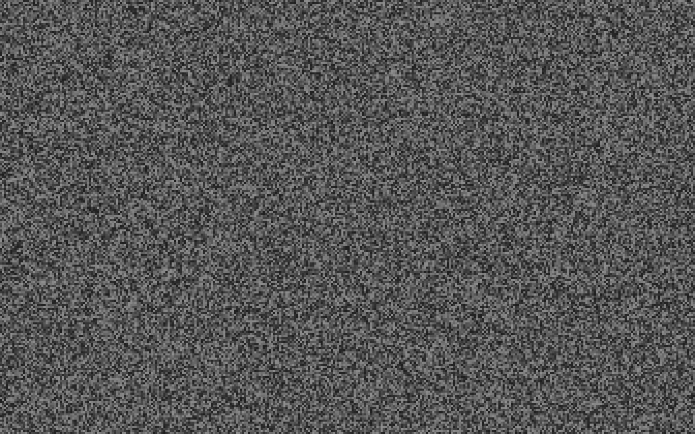

# nw-midnight [![Build Status][travis-image]][travis] [![Dependency Status][depstat-image]][depstat]

is Screen server by [NW.js](https://github.com/nwjs/nw.js)

## Usage
1. [Download ZIP](https://github.com/59naga/midnight/releases)
2. Open `midnight.exe` or `midnight.app`
3. Close `Ctrl+w` or `⌘+q`

# Test
```
$ npm i
$ npm test
```

# License
MIT @59naga

[travis-image]: https://travis-ci.org/59naga/midnight.svg?branch=master
[travis]: https://travis-ci.org/59naga/midnight
[depstat-image]: https://gemnasium.com/59naga/midnight.svg
[depstat]: https://gemnasium.com/59naga/midnight
